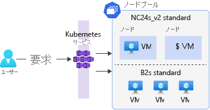

# ノードプール
AKS クラスター内のノードをグループ化するには、ノード プールなるものを作成する。

ノード プールを作成するときはアプリの要件に応じて各ノードの VM サイズと OS の種類 (Linux または Windows) を指定する。

ユーザー アプリケーション ポッドをホストするには、
ノード プールの [モード] が [ユーザー] または [システム] である必要がある。

デフォルトでAKS クラスターにはLinux ノード プール (システム モード) がある。

ただし、ポータルの作成ウィザード、CLI のパラメーター、または ARM テンプレートを使用して、Windows ノード プールを既定の Linux ノード プールと共に追加するように構成できる。

LinuxとWindowsの両方のコンテナが混在しているノードプールを作成することはできない。

