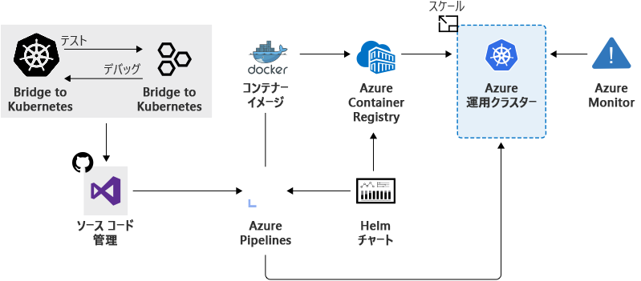

https://learn.microsoft.com/ja-jp/training/modules/intro-to-azure-kubernetes-service/2-what-is-azure-kubernetes-service

# 料金
- Azureでは、Kubernetesクラスターのコントロールプレーンの管理を無料で行うことができる。クラスター内のエージェントノードを管理し、ノードが実行されている VM に対してのみ料金を支払う

# クラスタのデプロイ
クラスターを作成する際にはクラスターの作成を自動化する Resource Manager テンプレートがある。

テンプレートを使用すると、高度なネットワーク オプション、Microsoft Entra Identity、リソース監視などの機能にアクセスできるらしい。

その後、トリガーとイベントを設定することで、複数のシナリオでクラスターのデプロイを自動化できる。

# AKSクラスターの作成
- Azure Portal または Azure CLIのいずれかで構築可能らしいが、個人的には Terraform で作りたい。
- クラスターの設定としては以下がある。
  - Kubernetes クラスター名
  - インストールする Kubernetes のバージョン
  - コントロールプレーンノードをパブリックにアクセスできるようにする DNS プレフィックス
  - 初期ノード プール サイズ
    - デフォルトは２つだが、本番環境では3つ以上が推奨とのこと

# ワークロードの開発と AKS へのデプロイ方法

上図が開発およびデプロイの一連の流れとなる。

AKS では、Helm、Draft、Visual Studio Code 用の Kubernetes 拡張機能、Visual Studio Kubernetes Tools などの一般的な開発および管理ツールもサポートしているらしい。

アプリケーションの DevOps パイプラインの設定を簡略化するため、 Azure DevOps Projects との統合ができる。

# Bridge to Kubernete（あとで調べる）
Bridge to Kubernetes を使用すると、開発用のコンピューター上でコードの実行とデバッグを行いながら、Kubernetes クラスターとの接続を保つことができる。

Bridge to Kubernetes では、Kubernetes クラスターと開発用コンピューターの間でトラフィックをリダイレクトする。
このブリッジにより、開発用コンピューター上のコードと、Kubernetes クラスターで実行されているサービスは、同じ Kubernetes クラスター内に存在するかのように通信できる

Bridge to Kubernetes を使用すると、コードを分離して開発でき、依存関係をレプリケートしたりモックアップしたりすることなく、他のコンポーネントと併せてエンド ツー エンドのテストを行うことができるらしい。

## CordonとDrainとは？
https://easy-study-forest.com/pod-node-cordon-drain/#toc8

どちらもNodeに対する命令
- Cordon
  - 該当ノードへのPodのデプロイを禁止する
- Drain
  - 該当ノードからPodを追い出す

この２つを使ってクラスターノードのアップデートが行える

# 監視
AKS には、クラスターのパフォーマンスの可視性を提供するためのコンテナーの Azure Monitor が含まれている

# 自動クラスター ノードおよびポッドのスケーリング
AKS では、2 つの自動クラスター スケーリング オプションがサポートされている

- ポッドの水平オートスケーラー
  - 水平ポッド オートスケーラーは、ポッドのリソース需要を監視し、需要に合うようにポッドのリソースを増やす
- クラスター オートスケーラー
  -  クラスター オートスケーラーは、ノードの制約のためにスケジュールできないポッドを監視します。 スケジュールされたポッドをデプロイするために、クラスター ノードが自動的にスケーリングされます。
    - よくわからん

# コンテナレジストリ
Azure Container Registry (ACR) がある
